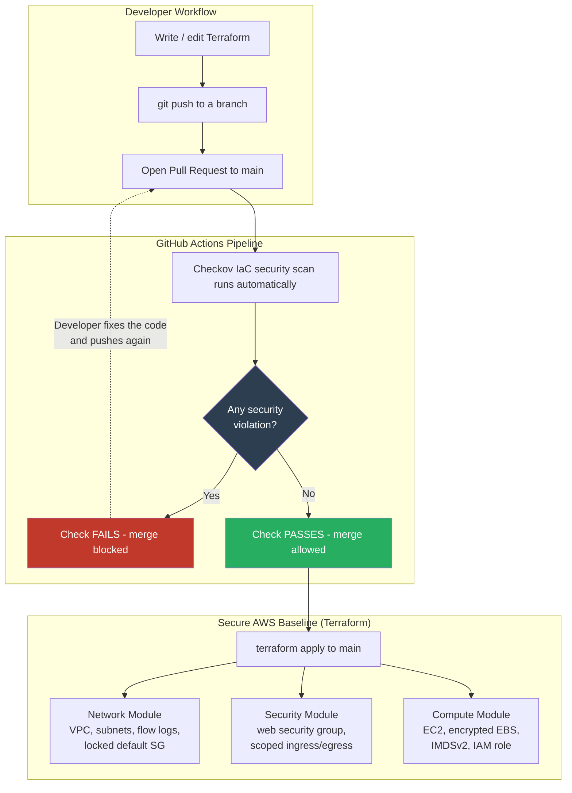

# Secure AWS Baseline with Automated Policy-as-Code Pipeline

A secure-by-default AWS environment built entirely with **Terraform**, guarded by a **CI/CD security pipeline** that automatically scans every change with **Checkov** and **blocks insecure infrastructure from ever being merged**.

This project demonstrates a complete **DevSecOps "shift-left" workflow**: security is enforced automatically at the pull-request stage, so a misconfiguration is caught *before* it can ever reach the cloud — not audited after the fact.

---

## Why this project exists

The majority of cloud breaches are not caused by sophisticated attacks — they are caused by **misconfiguration**: a storage bucket left public, a security group open to the internet, a database without encryption. Industry reporting has found that a large share of cloud environments contain at least one publicly exposed storage bucket, most created by infrastructure-as-code without encryption or access controls.

The traditional model is reactive: deploy first, then scan and clean up afterwards — by which point the misconfiguration is already live. This project inverts that model. Insecure infrastructure is caught **at the pull request** and physically cannot be merged.

---

## Architecture



**In one sentence:** every change to `main` must pass an automated Checkov scan; if the code contains a security misconfiguration, the merge is blocked until it is fixed.

---

## Proof the pipeline works

To validate the security gate, a **deliberately insecure S3 bucket** (public access enabled, no encryption) was submitted through a pull request. The pipeline caught it automatically and blocked the merge:

<!-- Add your blocked-merge screenshot here. Example:

-->

The required `Run Checkov IaC scan` check failed within seconds, and the merge button was disabled — exactly as designed.

---

## The secure baseline

The infrastructure is organised into three reusable Terraform modules, each hardened to **zero Checkov failures** against the CIS AWS Foundations Benchmark.

### Network module
- Custom VPC with segmented public and private subnets
- **VPC Flow Logs** enabled (all traffic), delivered to an encrypted CloudWatch Log Group
- **KMS key** with rotation enabled and an explicit, scoped key policy
- Default security group locked down to **deny all** traffic
- Least-privilege IAM role for the flow-log service (scoped to a single log group)

### Security module
- Web security group with tightly scoped rules
- Ingress limited to HTTP/HTTPS for the public web server
- **Egress scoped to ports 80/443 only** — a compromised host cannot exfiltrate over arbitrary ports

### Compute module
- EC2 instance with an **encrypted root volume**
- **IMDSv2 enforced** (`http_tokens = required`) — mitigates the SSRF-to-credential-theft attack class
- Detailed monitoring and EBS optimization enabled
- **Least-privilege IAM role** attached via instance profile (no `AdministratorAccess`, scoped trust policy)

### Documented, risk-based exceptions
Two findings are intentionally accepted and **documented in code** with `#checkov:skip` annotations and written justifications, rather than silently ignored:
- The public subnet assigns public IPs *by design* (it hosts the internet-facing web server).
- The web server accepts inbound HTTP from the internet *by design*.

This reflects real-world security engineering: not every finding is a bug — some are conscious trade-offs that should be recorded.

---

## Tech stack

| Area | Tools |
|---|---|
| Infrastructure as Code | Terraform |
| Cloud | AWS (VPC, EC2, S3, IAM, KMS, CloudWatch, Flow Logs) |
| Policy-as-Code / IaC Scanning | Checkov (CIS AWS Foundations Benchmark) |
| CI/CD | GitHub Actions |
| Enforcement | Branch protection with required status checks |

---

## How the pipeline works

The workflow at `.github/workflows/security-scan.yml` runs on every push and pull request to `main`:

1. Checks out the code onto a fresh runner.
2. Runs Checkov across all Terraform (`soft_fail: false`, so any violation fails the job).
3. The job is configured as a **required status check** via branch protection, so a failing scan **blocks the merge**.

---

## Running it locally

```bash
# Install Checkov
pipx install checkov

# Scan the whole project
checkov -d . --compact

# Scan a single module
checkov -d modules/network --compact
```

To deploy the baseline (requires configured AWS credentials):

```bash
terraform init
terraform plan
terraform apply
# Always tear down when finished to avoid charges:
terraform destroy
```

---

## What I learned

- Building modular, reusable Terraform and composing modules together
- Hardening cloud infrastructure against a recognised benchmark (CIS)
- Writing custom policy-as-code decisions and documenting accepted risk
- Automating security enforcement in CI/CD so it doesn't depend on human memory
- Practical DevSecOps supply-chain hygiene (keeping binaries and state out of version control)

---

## Author

**Arjun Dharun Raj R**
<!-- Add your links:
- LinkedIn: https://linkedin.com/in/your-profile
- GitHub: https://github.com/Arjun7114
-->
